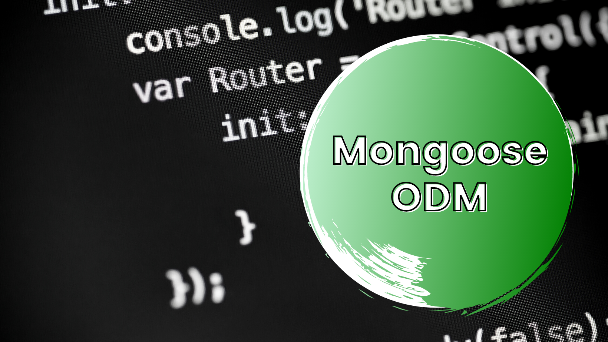

# Node Mongoose ODM (simple CRUD) 🚀🚀🚀

This guide looks at making CRUD operations using the [Mongoose ODM](https://mongoosejs.com/). 



The Mongoose methods highlighted are:

```
CREATE:
.save()
.create()
.insertMany()

READ:
.find()

UPDATE:
.updateOne()

DELETE:
.deleteOne()
```

All operations are kept in a single ```app.js``` so that it is easier to follow along with the code. Each operation is placed within a function that can be called so as to make it work. 

You can find the modularized version of this code [here](../modular/app.js)! 

## Getting Started 🏁

These instructions will help you get started with this project.

### Installing

Run:

```
npm install
```

This should retrieve all the necessary dependencies named in the `package.json` file.

### How To Use:

Once dependencies are installed, navigate to the ```app.js``` file. 

All functions are available to use, comment out the ones you don't need to test and run.

Once that is done, the project can be run using:

```
npm start
```
