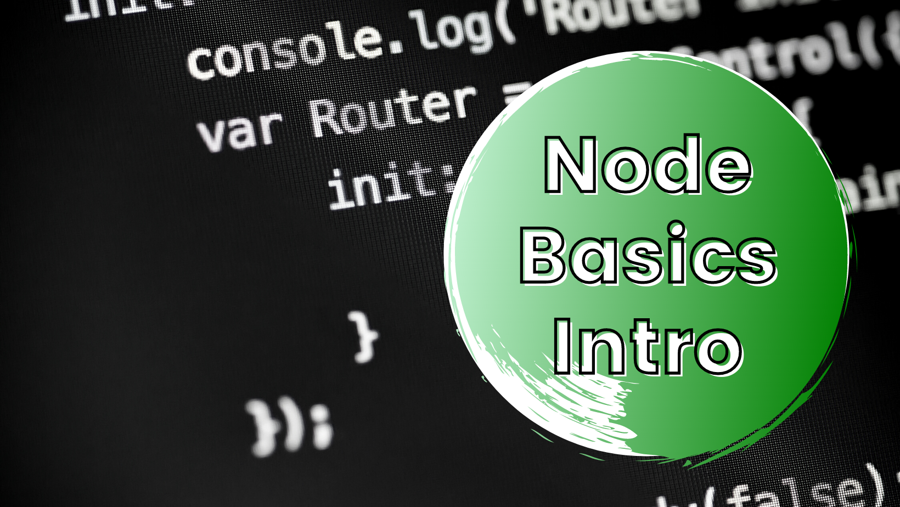

# Node Basics Intro 🚀🚀🚀

[](https://www.codefactor.io/repository/github/remrkabledev/node-basics-intro/overview/main) [](https://renovatebot.com)

This repo holds small node projects that introduce concepts, practices and techniques used with Node.js



## Getting Started

These instructions will get you a copy of the project up and running on your local machine for development and testing purposes.

### Prerequisites

What things you need to install the software and how to install them

```
NPM / Yarn
Code Editor (This app was built on VSCode)
Git
```

### Installing

To get this project on your local machine, you first need to clone it using the `git clone` command.

```
git clone https://github.com/reMRKableDev/node-basics-intro.git
```

Running this on your terminal will ensure you receive the latest version with all it's changes.

Once you've cloned, navigate into your desired project folder and run:

```
npm install
```

This should retrieve all the necessary dependencies named in the `package.json` file.

### How To Use:

Once dependencies are installed, each project can be run using:

```
npm start
```

## Running tests 🧪

The testing framework utilized is Jest. Tests can be run by using the command:

```
npm test

OR

npm run test
```

## Contributing 👋

When contributing to this repository, please first discuss the change you wish to make via issue, email, or any other method with the owners of this repository before making a change.

Please note that there is a code of conduct, please follow it in all your interactions with the project.

1. Ensure any install or build dependencies are removed before the end of the layer when doing a build.

2. Update the README.md with details of changes to the interface, this includes new environment variables, exposed ports, useful file locations and container parameters.

## Authors 💻

- **Malcolm R. Kente** - _Initial work_ - [reMRKable Dev](https://remrkabledev.com/)
- **Lloyd Chambrier** - developed `node-api-requests` & `node-omdb-api` repo found in` node-express-api` folder - [LloydC](https://github.com/LloydC)

## Acknowledgments 🗣️

[Node.js](https://nodejs.org/en/)

[Express.js](https://expressjs.com/)

[Handlebars.js](https://handlebarsjs.com/)

[MySQL Node.js JavaScript Client](https://github.com/mysqljs/mysql#readme)
